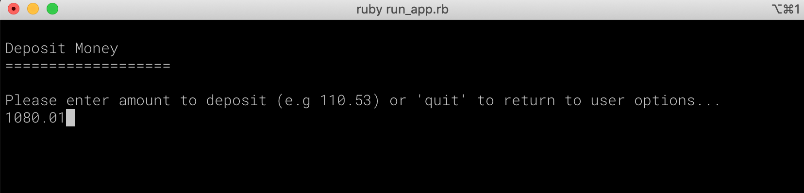

# Bank Tech Test
============
```
         _.---.._                _.---.._
        ';-.--';'    _.---.._   ';-..--';      
         }===={     ';-..--';    `}===={    
       .'  _|_ '.    `}===={    .:  _|_ '.
      /:: (_|_`  \  .:  _|_ '. /:: (_|_`  \    
     |::  ,_|_)    /:: (_|_`  \::  ,_|_)   |
     \::.   |     |::  ,_|_)   |:.   |     /
      '::_     _-;\::.   |     /::_     _-;
          `````    '::_     _-;    ````` 
                       ````` 
```

### Overview
Simple CLI banking program, which allows for a user to deposit and withdraw money, then print a statement which returns the history of their transactions.

### How to Install and Run

The app has been developed using Ruby v2.6.5 and is directly run from the command line. Therefore to run the app please ensure you have the following installed:
- ruby 2.6.5 (can be installed from the terminal using homebrew ```brew install ruby``` and version checked using rvm ```rvm use 2.6.5```)
- bundler (can be installed from the terminal through ruby gems ```gem install bundler```)

Once the above has been installed, clone or download the git repository, move to the program root directory, then run the following in the command line to start the program:
- ```bundle```
- ```ruby run_app.rb```

### How to Run Tests
Once the program has been installed and ```bundle``` run, to check the program is fully functional the test suite can be run. To run the test suite, navigate to the program root directory in the command line, then run the following command ```rspec```. If all tests come back green then the program should function as designed.

### Example

User installs program, navigates to the root directory, then runs ```ruby run_app.rb```, opening the CLI Homepage:

User enters selection of '2' and presses return to enter deposit money page:

User enters money to deposit and presses return to return to CLI. User then enters selection of '3' and presses return to enter withdrawal page:

User enters money to deposit and presses return to return to CLI. 

User enters selection of '1' and presses return to view statement:

User then clicks any key and presses enter to return to CLI, then enters '4' and presses return to quit program.

### Code Structure

The code has been designed with two classes to seperate the concerns of logic and user interface:
- BankAccount - handles model data and logic of withdrawals, deposits, and statements
- BankUi - Handles user inputs and displaying GUI for user to nagivate the program
- StatementGenerator - takes transaction history and returns pretty statement